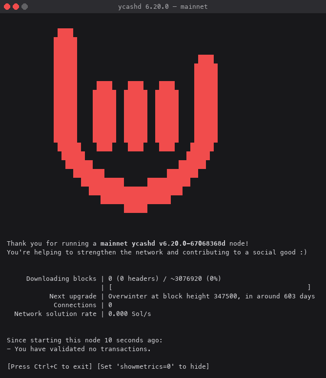

Ycash 6.20.0

===========

What is Ycash?
--------------

Ycash is a digital currency. For more information, see [y.cash](https://y.cash).

For a comparison of Ycash to Bitcoin, see the [Ycash fact sheet](https://y.cash/fact-sheet).

Ycash is a chain fork of Zcash: it shares Zcash's history up to the fork and
its privacy technology (shielded Sapling transactions built on zero-knowledge
proofs), and has followed its own chain since.

## The `ycashd` Full Node

This repository hosts `ycashd`, the Ycash consensus node, together with
`ycash-cli` (its RPC client) and `ycash-gtest` (its unit tests). It downloads
and stores the entire history of Ycash transactions; depending on the speed of
your computer and network connection, the synchronization process could take
a day or more. The node reads its settings from `ycash.conf` in its data
directory (`~/.ycash` on Linux, `~/Library/Application Support/Ycash` on macOS,
`%APPDATA%\Ycash` on Windows). If you are upgrading from Ycash 4.4.4 or 4.5.0,
the binaries (`ycashd`, `ycash-cli`), `ycash.conf` and the data directory
locations are unchanged.

<p align="center">
  
  <br>
  <em>The startup screen, captured from <code>ycashd</code> v6.20.0 on a fresh, unconnected mainnet data directory.</em>
</p>

This is the Ycash node rebased by the Ycash developers onto the Zcash 6.20.0
code base. The Zcash code is in turn derived from a source fork of
[Bitcoin Core](https://github.com/bitcoin/bitcoin), initially from Bitcoin Core
v0.11.2; the codebases have since diverged substantially.

**Ycash is experimental and a work in progress.** Use it at your own risk.

## Getting Started

Ycash is a chain fork of Zcash, so for most topics, including `zcashd`
internals, the Zcash documentation applies: see the
[zcashd user guide](https://zcash.readthedocs.io/en/latest/rtd_pages/zcashd.html).
Read `zcashd` as `ycashd`, `zcash-cli` as `ycash-cli` and `zcash.conf` as
`ycash.conf`.

### Need Help?

* Visit [y.cash](https://y.cash).
* Ask for help in one of the [Ycash forums](https://y.cash/forums).

Participation in the Ycash project is subject to a
[Code of Conduct](code_of_conduct.md).

### Building

Build Ycash along with most dependencies from source by running the following command:

```
./zcutil/build.sh -j$(nproc)
```

This produces `src/ycashd` and `src/ycash-cli`; `make check` also builds and
runs `src/ycash-gtest`. The build prerequisites are those of `zcashd`; see the
[zcashd install instructions](https://zcash.readthedocs.io/en/latest/rtd_pages/zcashd.html#install).

### Deprecation Policy

Unlike upstream Zcash, Ycash does not shut a node down at a deprecation
height: the automatic deprecation shutdown is disabled (see
[src/deprecation.h](src/deprecation.h)), and the RPC features upstream
deprecates stay enabled by default (`-allowdeprecated`).

## Ycash Yellowback (YED)

This tree also carries Ycash Yellowback (YED), an over-collateralised US-dollar
stablecoin overlay on Ycash: YEC is locked in a vault to mint YED, and YED moves
in ordinary transparent Ycash transactions.

* **Optional and off by default.** Yellowback runs only when the node is
  started with `-experimentalfeatures -yellowback`. Without it the node runs
  the code paths of the plain ycashd 6.20.0 baseline.
* **No network upgrade.** Yellowback adds no opcode, transaction format or
  consensus branch ID, and needs no hard fork. Its rules are enforced by
  participating miners as a soft fork that stays inert until pools signal
  activation on chain, and an operator can switch enforcement off with one flag.

Read more:

* [doc/yellowback.md](doc/yellowback.md): the user guide;
* [doc/yellowback-devnet.md](doc/yellowback-devnet.md): a local devnet or a regtest node in a few minutes;
* [doc/yellowback-review.md](doc/yellowback-review.md): what the overlay changes in ycashd 6.20.0 and the evidence that it is safe;
* [doc/yellowback-baseline.md](doc/yellowback-baseline.md): the 6.20.0 baseline the overlay is built on, and what it took to build and run it.

License
-------

For license information see the file [COPYING](COPYING).
